<h2 align="center">
    <a href="https://dainam.edu.vn/vi/khoa-cong-nghe-thong-tin">
    Faculty of Information Technology - Dai Nam University
    </a>
</h2>

<h2 align="center">
    ERP: HE THONG QUAN LY NHAN SU, KHACH HANG VA VAN BAN
</h2>

<div align="center">

[](https://www.odoo.com/)
[](https://www.python.org/)
[](https://www.postgresql.org/)
[](https://developer.mozilla.org/en-US/docs/Web/JavaScript)
[](https://ai.google.dev/)

</div>

---

## 1. Gioi Thieu

**ERP: He thong quan ly nhan su, khach hang va van ban** la he thong duoc xay dung tren nen tang **Odoo 15**, tap trung vao ba nhom nghiep vu chinh: **Quan ly nhan su (QLNS)**, **Quan ly van ban (QLVB)** va **Quan ly khach hang (QLKH)**.

He thong khong chi quan ly du lieu rieng le theo kieu CRUD, ma tich hop cac module theo luong nghiep vu end-to-end: nhan vien tu QLNS duoc gan phu trach khach hang, van ban trong QLVB duoc lien ket voi khach hang/nhan vien/phong ban, QLKH theo doi ho so khach hang, don hang, thanh toan, cong no va cham soc khach hang.

Du an co tich hop **Google Gemini AI** de phan tich van ban, phan tich ho so khach hang, tro ly hoi dap va goi y tin nhan cham soc khach hang. Ngoai ra, he thong co **ung dung ben ngoai cong 8070**, ket noi Odoo thong qua **XML-RPC External API**.

---

## 2. Thanh Vien Thuc Hien

| STT | Ma sinh vien | Ho va ten | Lop | Nhom |
| --- | ------------ | --------- | --- | ---- |
| 1 | 1771020581 | Le Son Quang  | CNTT 17-02 | Nhom 10 |
| 2 | 1771020648 | Tran Van Thinh| CNTT 17-02 | Nhom 10 |
| 3 | 1771020282 | Nguyen Thi Hoa| CNTT 17-02 | Nhom 10 |
| 1 | 1771020581 | Ha Quang Dung | CNTT 17-02 | Nhom 10 |


---

## 3. Cong Nghe Su Dung

| Thanh phan | Cong nghe |
| ---------- | --------- |
| Nen tang ERP | Odoo 15 |
| Backend | Python, Odoo ORM |
| Frontend | XML View, JavaScript, QWeb |
| Database | PostgreSQL |
| AI API | Google Gemini API |
| External API | XML-RPC Odoo External API |
| Ung dung ngoai | Python HTTP Server, cong 8070 |
| Moi truong | Ubuntu 22.04 / WSL |

---

## 4. Chuc Nang Chinh

### 4.1. Quan Ly Nhan Su - QLNS

- Quan ly ho so nhan vien.
- Quan ly phong ban, chuc vu.
- Quan ly hop dong lao dong.
- Quan ly nghi phep.
- Quan ly tuyen dung.
- Quan ly dao tao, bang cap, chung chi.
- Quan ly danh gia nhan vien.
- Dashboard tong quan nhan su.
- Cung cap du lieu nhan vien lam du lieu goc de gan nguoi phu trach khach hang, nguoi xu ly van ban va du lieu cham cong/luong.

### 4.2. Cham Cong Va Luong

- Quan ly luong co ban.
- Quan ly cham cong.
- Quan ly khen thuong, ky luat.
- Lap phieu luong.
- Tich hop voi QLNS thong qua du lieu nhan vien va hop dong lao dong.

### 4.3. Quan Ly Van Ban - QLVB

- Quan ly van ban den.
- Quan ly van ban di.
- Quan ly loai van ban.
- Phan nhom van ban: gui nhan vien, gui phong ban, noi bo, co quan/doi tac, van ban chung, van ban lien quan khach hang.
- Chon nguoi nhan theo khach hang, nhan vien hoac phong ban.
- Theo doi trang thai ho so va trang thai xu ly.
- Dinh kem tep van ban.
- Dashboard quan ly van ban.
- AI phan tich van ban: tom tat, muc uu tien, canh bao xu ly gap va goi y hanh dong.

### 4.4. Quan Ly Khach Hang - QLKH

- Quan ly ho so khach hang.
- Tao ma khach hang tu dong.
- Phan loai khach hang.
- Gan nhan vien phu trach tu QLNS.
- Quan ly van ban den/di cua khach hang.
- Quan ly don hang/dich vu.
- Quan ly thanh toan va cong no.
- Quan ly cham soc khach hang: kenh lien he, muc dich, lich hen tiep theo, ket qua va trang thai.
- AI phan tich ho so khach hang va goi y tin nhan cham soc.

### 4.5. Tro Ly AI

- Chat voi AI ngay trong Odoo.
- Lay ngu canh tong hop tu QLNS, QLVB va QLKH.
- Tra loi cau hoi ve nhan su, van ban, khach hang, don hang, cong no va lich su cham soc.
- Su dung Gemini API khi duoc cau hinh key.

### 4.6. Ung Dung Ben Ngoai 8070

- Chay rieng ngoai Odoo tai `http://localhost:8070`.
- Ket noi Odoo qua XML-RPC External API.
- Xem danh sach khach hang.
- Xem danh sach van ban.
- Tao khach hang moi tu app ngoai vao Odoo.

---

## 5. Kien Truc He Thong

He thong duoc thiet ke theo mo hinh **Client - Odoo Server - Database - External Services**.

```text
Nguoi dung / Trinh duyet
        |
        v
Odoo Web UI - localhost:8069
        |
        v
Custom Addons: QLNS, Cham cong & Luong, QLVB, QLKH, AI Tro ly
        |
        v
PostgreSQL Database

External App 8070  --->  Odoo XML-RPC External API
Gemini API         <---  Odoo Gemini Service
```

File PlantUML mo ta kien truc he thong:

```text
docs/architecture/system_architecture.puml
```

---

## 6. Luong Nghiep Vu End-to-End

So do luong nghiep vu tong quan duoc luu tai:

```text
docs/business-flow/NhomXX_BusinessFlow_QLNS_QLVB_QLKH.pdf
```

Luong nghiep vu chinh:

1. Khach hang duoc tao trong Odoo hoac tu app ngoai 8070.
2. He thong gan nhan vien phu trach tu module QLNS.
3. Nhan vien tao van ban den/di lien quan khach hang hoac van ban noi bo.
4. Gemini AI phan tich van ban, tom tat va goi y muc uu tien.
5. Ho so khach hang duoc cap nhat voi van ban, don hang va cong no.
6. Nhan vien tao lich cham soc khach hang.
7. AI goi y tin nhan cham soc theo tinh trang khach hang.
8. Quan ly theo doi dashboard, cong no, van ban can xu ly va ket qua cham soc.

---

## 7. Giao Dien He Thong

### 7.1. Dashboard QLNS

<p align="center">
  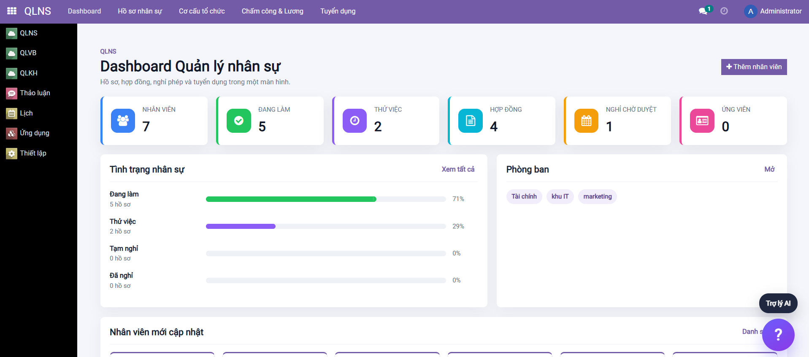
</p>

### 7.2. Danh Sach Nhan Vien

<p align="center">
  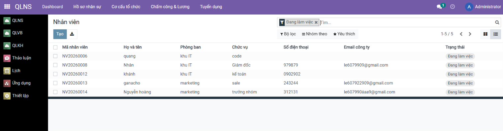
</p>

### 7.3. Chi Tiet Nhan Vien

<p align="center">
  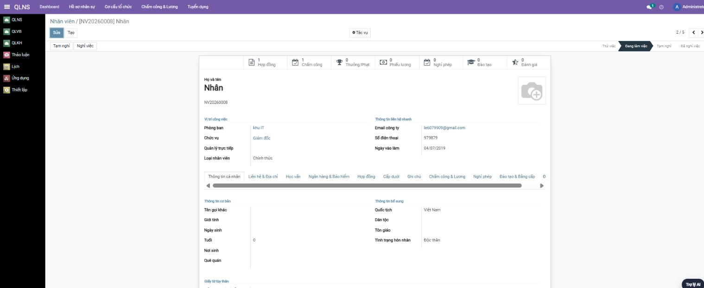
</p>

### 7.4. Cham Cong Va Luong

<p align="center">
  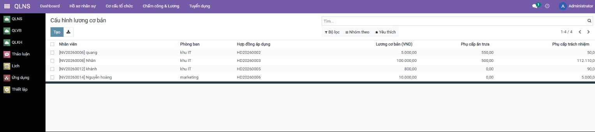
</p>

### 7.5. Dashboard QLVB

<p align="center">
  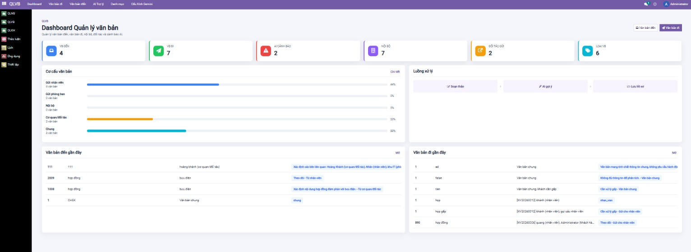
</p>

### 7.6. Van Ban Den

<p align="center">
  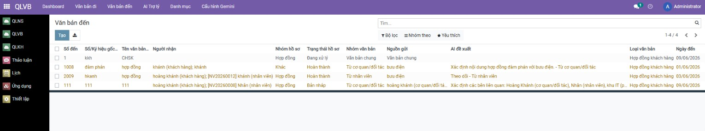
</p>

### 7.7. Van Ban Di

<p align="center">
  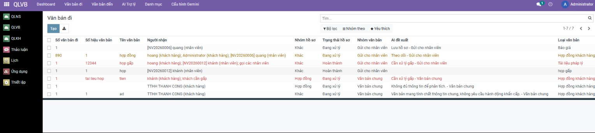
</p>

### 7.8. AI Phan Tich Van Ban

<p align="center">
  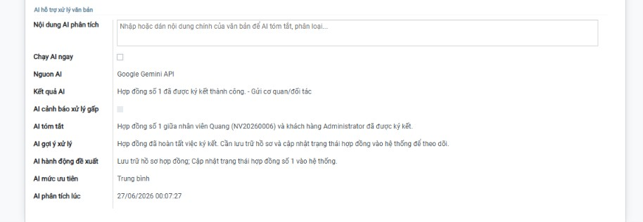
</p>

### 7.9. Tro Ly AI

<p align="center">
  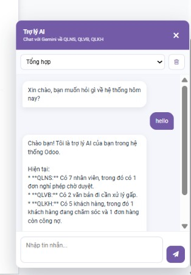
</p>

### 7.10. Dashboard QLKH

<p align="center">
  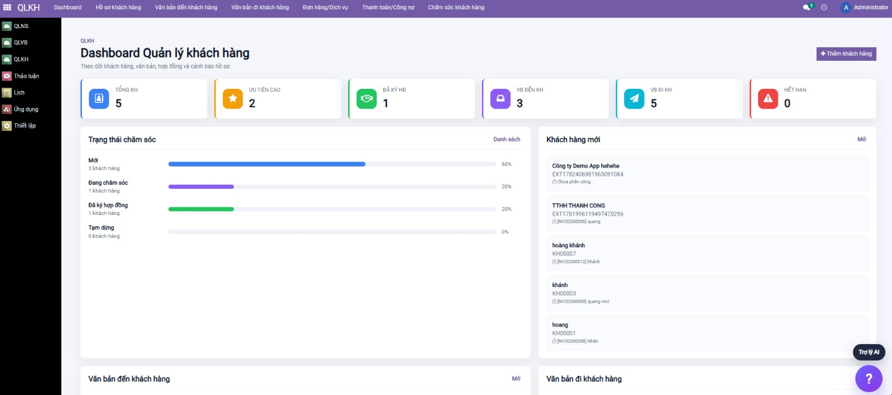
</p>

### 7.11. Ho So Khach Hang

<p align="center">
  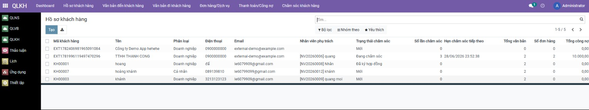
</p>

### 7.12. Don Hang / Dich Vu

<p align="center">
  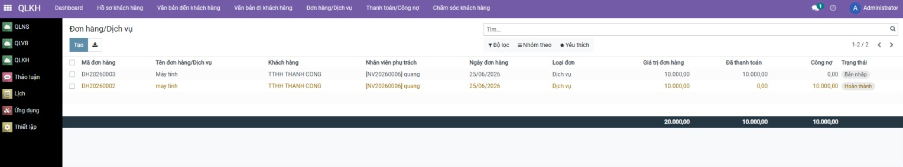
</p>

### 7.13. Thanh Toan / Cong No

<p align="center">
  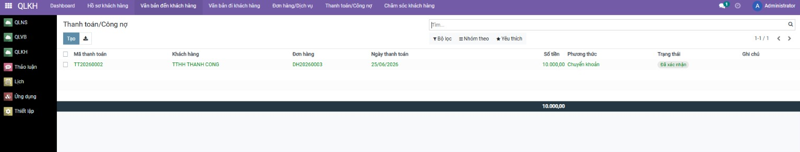
</p>

### 7.14. Cham Soc Khach Hang Va AI Goi Y Tin Nhan

<p align="center">
  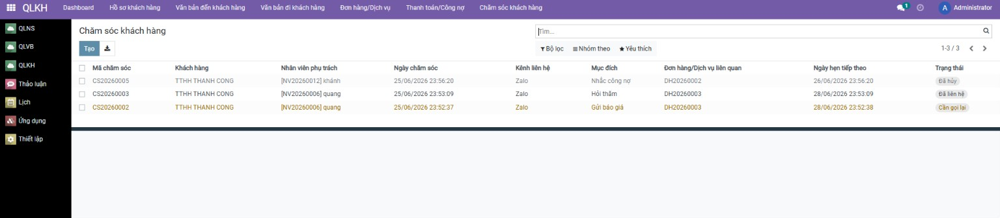
</p>

### 7.15. Ung Dung Ben Ngoai 8070

<p align="center">
  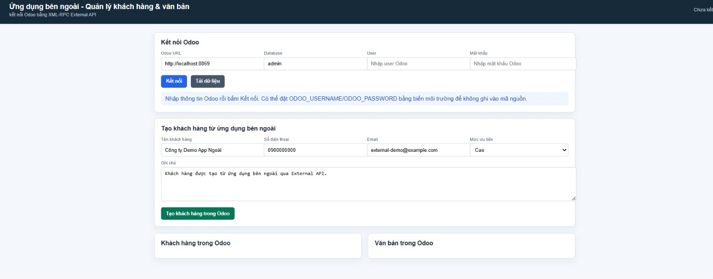
</p>

---

## 8. Cau Hinh AI Va Bao Mat Bien Nhay Cam

Khong ghi API key hoac mat khau truc tiep vao ma nguon.

### Gemini API

Co the cau hinh trong Odoo tai:

```text
QLVB > Cau hinh Gemini
```

Hoac dat bien moi truong tren terminal chay Odoo:

```bash
export GEMINI_API_KEY="gemini-key-cua-ban"
export GEMINI_MODEL="gemini-2.5-flash"
```

### External App 8070

Dat thong tin ket noi Odoo bang bien moi truong:

```bash
export ODOO_URL="http://localhost:8069"
export ODOO_DB="admin"
export ODOO_USERNAME="tai-khoan-odoo"
export ODOO_PASSWORD="mat-khau-odoo"
```

---

## 9. Cai Dat Va Chay He Thong

### 9.1. Cai Dat Thu Vien He Thong

```bash
sudo apt-get update
sudo apt-get install -y libxml2-dev libxslt-dev libldap2-dev libsasl2-dev \
    libssl-dev libffi-dev zlib1g-dev build-essential libpq-dev \
    python3-dev python3-venv python3-pip
```

### 9.2. Tao Moi Truong Ao Python

```bash
cd /home/quang/odoo-fitdnu
python3 -m venv venv
source venv/bin/activate
pip install -r requirements.txt
```

### 9.3. Chay PostgreSQL

Neu dung Docker Compose:

```bash
docker-compose up -d
```

### 9.4. Cau Hinh Odoo

Tao file `odoo.conf`:

```ini
[options]
addons_path = /home/quang/odoo-fitdnu/addons,/home/quang/odoo-fitdnu/odoo/addons
db_host = localhost
db_port = 5432
db_user = odoo
db_password = odoo
xmlrpc_port = 8069
```

### 9.5. Chay Odoo 8069

```bash
cd /home/quang/odoo-fitdnu
./venv/bin/python ./odoo-bin -c odoo.conf
```

Truy cap:

```text
http://localhost:8069
```

### 9.6. Cap Nhat Module

```bash
./venv/bin/python ./odoo-bin -c odoo.conf -d admin \
    -u nhan_su,quan_ly_cham_cong_luong,quan_ly_van_ban,quan_ly_khach_hang_van_ban
```

---

## 10. Chay Ung Dung Ben Ngoai 8070

Mo terminal moi:

```bash
cd /home/quang/odoo-fitdnu
python3 external_app/odoo_external_app.py
```

Truy cap:

```text
http://localhost:8070
```

---

## 11. Y Nghia Voi Yeu Cau Nang Cao

- **Tich hop AI**: Gemini AI duoc dung de phan tich van ban, ho so khach hang, tro ly hoi dap va goi y tin nhan cham soc.
- **Tich hop External API**: app ngoai 8070 ket noi Odoo bang XML-RPC External API.
- **Tich hop lien module**: QLNS cung cap nhan vien phu trach; QLVB quan ly van ban; QLKH su dung khach hang, van ban, don hang, thanh toan va cham soc.
- **Quan ly end-to-end**: tu tao khach hang, phan cong nhan vien, lap van ban, AI phan tich, cham soc khach hang den theo doi cong no.

---

## 12. Huong Mo Rong

- Tich hop gui SMS/Zalo/Email that thay vi chi goi y noi dung tin nhan.
- Bo sung OCR de doc noi dung van ban scan.
- Bo sung chu ky so cho hop dong/van ban.
- Bo sung bao cao PDF va bieu do thong ke nang cao.
